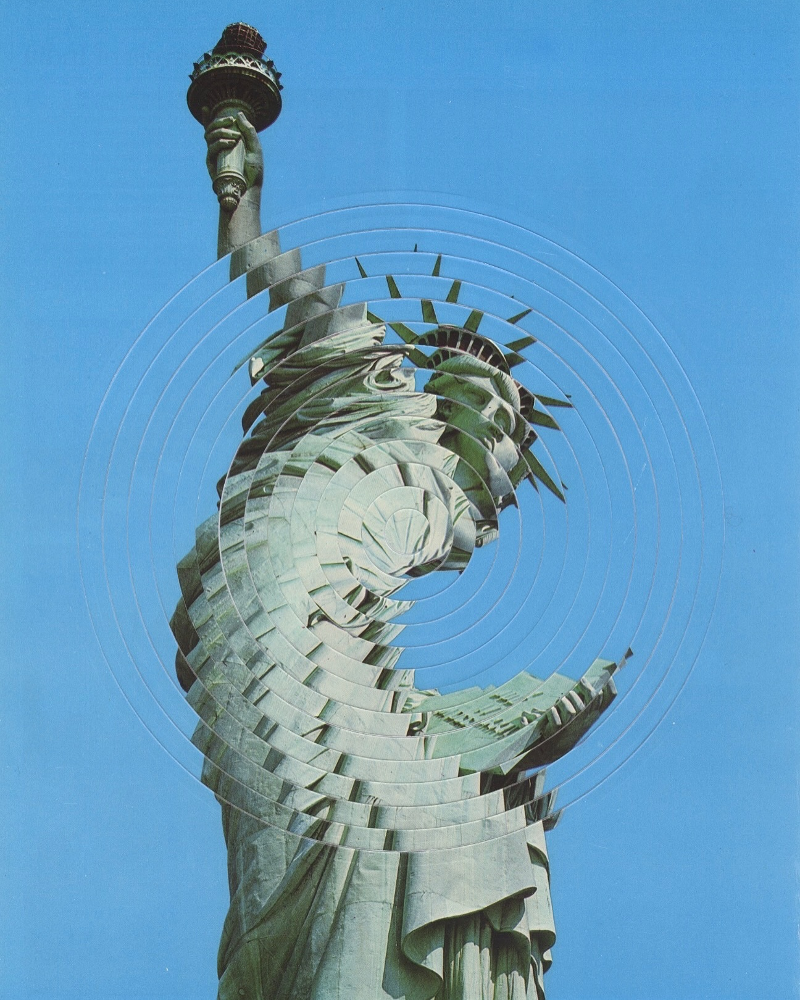
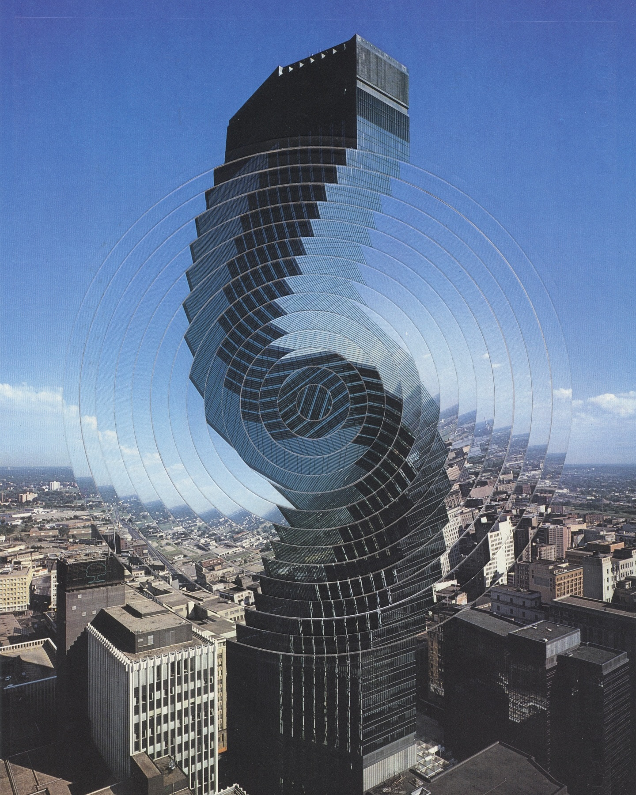
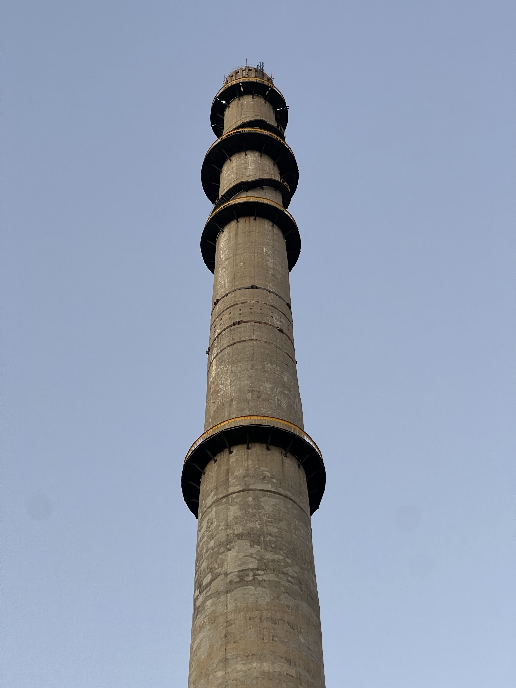
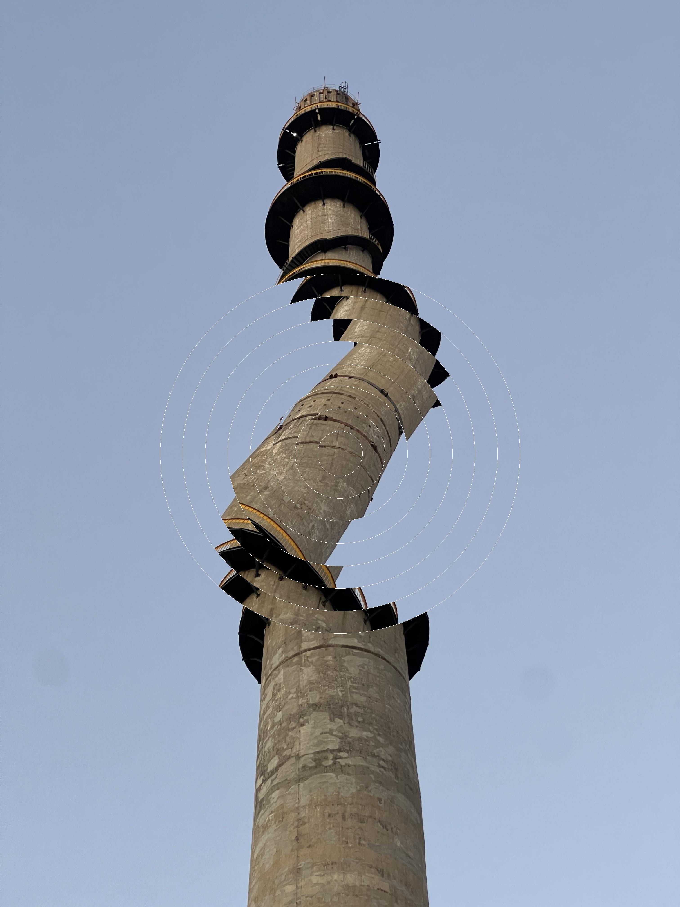
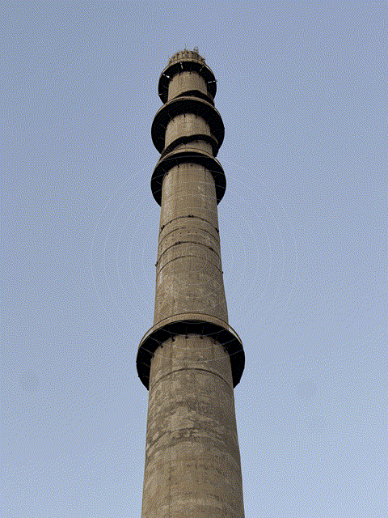

# 环影旋光 (Ring Spin) 特效生成器


[English](README.md) | **中文**

## 简介

我被艺术家[Charlie Elms](https://www.instagram.com/10.years.time/)的拼贴画所震撼，尤其是[下面这一组扭曲的效果](https://www.instagram.com/p/DChFXFoKXKP)，它以一种独特的视觉效果吸引了我的注意。我决定用代码来实现这种视觉效果，以便我可以将它应用到我的照片中。

| 扭曲的自由女神   | 扭曲的建筑 |
| :---: |:---: |
|  |  |

本项目是一个 Python 脚本，可以为图片生成一种“环影旋光”的视觉特效。它将图片围绕指定中心点划分为多个同心圆环，并让每个圆环在动画中旋转不同的角度，从而创造出一种动态、炫酷的视觉效果。

该脚本支持输出多种格式，包括：
*   **静态图片 (JPG)**：保存动画的最后一帧。
*   **动图 (GIF)**：生成循环播放的 GIF 动画。
*   **视频 (MP4)**：生成带或不带音效的 MP4 视频。
*   **实况照片 (Live Photo)**：为苹果设备生成可动的实况照片，可以通过AirDrop传到iPhone上。

此外，你还可以为视频格式添加循环音效，让效果更加生动。

## 截图

下面是使用本项目生成的效果示例：

| 原始图片 | 效果图 (JPG) | 效果视频 (GIF) |
| :---: | :---: | :---: |
|  |  |  |

## 依赖

在运行此项目之前，请确保您已安装以下依赖：

*   Python 3.x
*   NumPy
*   Pillow (PIL)
*   OpenCV for Python (`opencv-python`)
*   **FFmpeg**：必须安装在您的系统中，并且其路径已添加到环境变量中。

**可选依赖：**

*   `pillow-heif`：如果需要处理 HEIC 格式的图片。
*   `makelive`：如果需要生成 Live Photo。

您可以使用 pip 安装所需的 Python 库：
```bash
pip install numpy pillow opencv-python pillow-heif makelive
```


## 使用

### 1. 作为 Python 库使用

您可以将 `ring_spin` 函数导入到您自己的 Python 脚本中：

```python
from ring_spin import ring_spin

ring_spin(
    image_path="data/in/chimney.jpg",
    center_rel_pos=(0.5, 0.5),
    num_rings=8,
    ring_width=100,
    rotate_angles=,
    num_steps=10,
    audio_path="data/in/click.wav",
    duration_in_sec=3.0,
    output_dir="data/out",
    output_name="my_effect",
    output_formats=["jpg", "gif", "mp4", "live"]
)
```
### 2. 通过命令行运行

您也可以直接通过命令行来运行此脚本，并传入自定义参数。

```bash
python ring_spin.py [image_path] [options]
```
**命令行参数说明：**

*   `image_path`: (必须) 输入图像的路径。
*   `--center_rel_pos`: 圆心的相对坐标 (默认: 0.5 0.5)。
*   `--num-rings`: 圆环数量 (默认: 8)。
*   `--ring-width`: 每个圆环的宽度（像素） (默认: 100)。
*   `--rotate-angles`: 每个圆环旋转的角度列表 (默认: 10 20 30 40 40 30 20 10)。
*   `--num_steps`: 动画的步数 (默认: 10)。
*   `--audio-path`: 音频文件路径，用于添加到视频中。
*   `--duration_in_sec`: 动画的总时长（秒） (默认: 3.0)。
*   `--output-dir`: 输出目录 (默认: data/out)。
*   `--output-name`: 输出文件的基础名称 (默认: 与输入文件名相同)。
*   `--output-formats`: 输出格式列表 (默认: jpg gif mp4 live)。

## 示例

**基础示例：**
生成一张 JPG 效果图和一个 MP4 视频。

```bash
python ring_spin.py data/in/chimney.jpg --output-dir data/out --output-formats jpg mp4
```

**高级示例：**
自定义圆环数量、宽度，并为生成的视频添加音效。

```bash
python ring_spin.py data/in/tree.HEIC \
    --num-rings 10 \
    --ring-width 80 \
    --rotate-angles 5 10 15 20 25 25 20 15 10 5 \
    --audio-path data/in/click.wav \
    --output-formats mp4 gif
```

## License

MIT